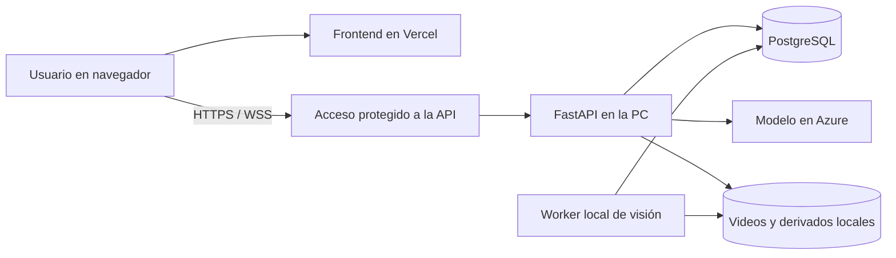

# Despliegue de FlowSight con frontend en Vercel

Evaluación del 1 de octubre de 2026. Esta es una propuesta de despliegue: no crea recursos, instala herramientas, publica código ni modifica PostgreSQL compartido.

## Recomendación para el TP

Publicar React/Vite en Vercel y mantener FastAPI más el worker en la misma PC de procesamiento. El navegador se conecta directamente a la API mediante HTTPS/WSS. PostgreSQL puede seguir en Azure Flexible Server y el chat usa el deployment de Azure configurado en el backend.



El frontend es estático; las consultas y las subidas van del navegador a la API, sin atravesar una función de Vercel. La API y el worker necesitan la misma `FLOWSIGHT_VIDEOS_DIR`, base y configuración de máquina. El worker actual toma trabajos de PostgreSQL y lee los archivos desde disco; sus snapshots también se consultan desde la API. Una API alojada en otra máquina no accede a esos archivos por compartir la base.

Para la demo se puede evaluar un túnel persistente hacia `http://127.0.0.1:8000`, con hostname estable y acceso autenticado. [Cloudflare Tunnel](https://developers.cloudflare.com/cloudflare-one/networks/connectors/cloudflare-tunnel/) conecta el origen mediante conexiones salientes y admite tráfico del servicio local. Cloudflare también admite [WebSockets](https://developers.cloudflare.com/network/websockets/). Instalar/configurar el conector y elegir dominio son pasos pendientes.

El túnel debe respetar el tamaño de los videos: el proxy de Cloudflare tiene un [límite de subida por petición de 100 MB en Free/Pro](https://developers.cloudflare.com/cache/concepts/default-cache-behavior/). Para clips mayores hay que elegir otro transporte con límites adecuados o implementar carga por partes; el endpoint actual recibe una sola subida. Probar el clip de demo y sus tiempos antes de elegir el proveedor.

Esta modalidad depende de que la PC, la API, el worker, el túnel y la conexión a Internet estén disponibles. Apagar la PC deja la interfaz publicada, pero impide usar las funciones del sistema. No equivale a disponibilidad continua.

## Configuración del proyecto en Vercel

Después de revisar y publicar la rama mediante el flujo de PR del equipo, importar el repositorio en Vercel. Para una primera validación usar un deployment de Preview; seleccionar `main` como Production Branch cuando se integre.

| Ajuste | Valor |
| --- | --- |
| Root Directory | `frontend` |
| Framework Preset | `Vite` |
| Install Command | `npm ci` |
| Build Command | `npm run build` |
| Output Directory | `dist` |
| Variable del frontend | `VITE_API_BASE_URL=https://api.example.com` |

`api.example.com` es un ejemplo: reemplazarlo por la URL real del backend, sin barra final. No usar `localhost` o `127.0.0.1` en el deployment: representan la computadora de cada visitante. Configurar la variable por separado para Preview y Production y volver a desplegar después de cambiarla, porque Vite incorpora su valor durante el build. No apuntar previews de prueba a una base con datos reales.

La app usa rutas como `/sessions/{id}/results`. Crear **`frontend/vercel.json`** con la regla de SPA para que recargar esas rutas devuelva `index.html`:

```json
{
  "$schema": "https://openapi.vercel.sh/vercel.json",
  "rewrites": [
    { "source": "/(.*)", "destination": "/index.html" }
  ]
}
```

El archivo se muestra como preparación pendiente; no existe todavía en el repositorio. La configuración sigue la [guía oficial de Vite en Vercel](https://vercel.com/docs/frameworks/frontend/vite). No requiere cambiar a Next.js.

En la API configurar el origen exacto del frontend:

```dotenv
FLOWSIGHT_CORS_ORIGINS=["https://flowsight.example.com"]
```

Para Preview autorizar su URL exacta en el backend del entorno de prueba. El backend actual acepta una lista JSON de orígenes; no incluye automáticamente todos los subdominios de Vercel. Las conexiones de avance deben usar WSS cuando el sitio usa HTTPS.

Las variables de PostgreSQL y Azure AI permanecen en el backend. En Vercel se necesita la URL pública de la API, nunca contraseñas ni claves del modelo. Revisar los archivos del commit antes de hacer push: `env.txt` está fuera del commit y puede contener información privada.

## Por qué mantener la API fuera de Vercel inicialmente

Vercel [admite FastAPI](https://vercel.com/docs/frameworks/backend/fastapi) y actualmente ofrece [WebSockets en beta](https://vercel.com/docs/functions/websockets), incluido ASGI/Python. No se descarta por ausencia de soporte WebSocket.

El problema concreto es la arquitectura actual: videos, frames, evidencia y snapshots están en el disco del equipo; el worker es un proceso persistente separado. Además, el proyecto fija Python 3.11, mientras el [runtime Python documentado de Vercel](https://vercel.com/docs/functions/runtimes/python) ofrece 3.12/3.13/3.14, y las [peticiones a Functions tienen un límite de 4,5 MB](https://vercel.com/docs/functions/limitations). El lock del backend incluye PyTorch/Ultralytics y no separa las dependencias de API y worker.

Mover la API a Functions requeriría validar Python y dependencias, separar almacenamiento/transporte, cambiar la carga directa de videos y comprobar la previsualización distribuida. Publicar solo el frontend evita esos cambios para la demo del MVP.

## Preparación antes de exponer la API

El servidor actual no implementa login ni autorización por usuario: cualquiera con acceso a la API puede consultar, cargar o retirar sesiones y consumir el chat. CORS configura al navegador; no autentica usuarios. Proteger únicamente el sitio de Vercel tampoco protege la URL del backend.

Antes de ofrecer un enlace funcional fuera del equipo:

1. Implementar autenticación y permisos en API y WebSocket, o una protección de acceso equivalente que cubra ambos. Validar el flujo entre dominios: el frontend actual no implementa una sesión de login ni credenciales de cookies entre orígenes. No incrustar un token compartido en `VITE_*`.
2. Elegir el entorno de datos, hacer backup y aplicar Alembic hasta `0006_session_removal`. Coordinar la migración si se usa la base compartida; luego reiniciar la API con el código actualizado. La instancia Azure configurada se migró el 2026-10-01 por autorización del usuario; verificar la revisión antes de desplegar en otro entorno.
3. Configurar HTTPS/WSS y CORS, y limitar tamaño de carga, concurrencia de análisis y uso del chat. Medir el tamaño y tiempo de los clips reales.
4. Mantener un solo worker inicialmente. La recuperación actual de trabajos interrumpidos es global; escalar workers requiere revisar esa coordinación. Seleccionar detector `ultralytics` y pesos validados para video real; `fake` corresponde a pruebas.
5. Preparar inicio supervisado, logs, backups y retención de archivos. Eliminar del historial no libera almacenamiento.
6. Probar desde otra PC: carga, configuración, análisis real, avance por WSS, resultados, chat, eliminación, recarga de rutas y recuperación frente a desconexión. Las pruebas existentes no sustituyen esta verificación del deployment.

## Evolución para disponibilidad continua

Si se necesitan resultados y chat disponibles con la PC apagada, evaluar FastAPI en [Azure App Service](https://learn.microsoft.com/en-us/azure/app-service/configure-language-python), con PostgreSQL en Azure y worker local. Para mantener también carga, frames y preview, primero diseñar almacenamiento y transferencia entre esa API y el worker: por ejemplo, descarga/subida autenticada con caché local y publicación de snapshots. Azure Blob sería una opción a evaluar, no una dependencia adoptada ni una autorización para cambiar el alcance acordado de almacenamiento local.

El worker sigue ejecutando YOLO localmente. La API en la nube no debe asumir una ruta local accesible ni una GPU remota. Mientras la PC esté apagada se pueden servir resultados persistidos, pero nuevos análisis quedan en espera hasta que el worker vuelva. La cola, la propiedad de trabajos, los reintentos y el estado de disponibilidad del worker requieren una validación específica antes de prometer ese comportamiento.

El plan [Hobby de Vercel](https://vercel.com/docs/plans/hobby) se orienta a uso personal y no comercial; revisar sus condiciones para la cuenta/repositorio del equipo. API alojada, almacenamiento, transferencia, PostgreSQL y Azure AI tienen costos/cuotas separados. No se midieron costos ni se validó disponibilidad de créditos de estudiantes para esos recursos.

## Próximo incremento propuesto

Preparar primero autenticación, límite de cargas y configuración de Vercel en un entorno de demo aislado. Luego probar la API local mediante una URL HTTPS estable y completar el recorrido real antes de publicar el enlace al curso. Mantener el worker y los archivos juntos permite llegar a esa demo con cambios acotados.
